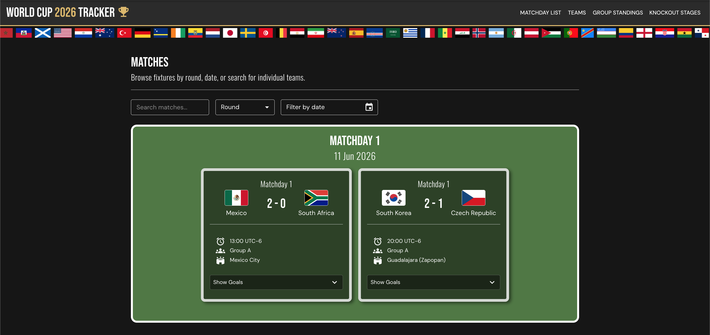

# 🏆 World Cup 2026 Tracker

A live, fully responsive React app for following the 2026 FIFA World Cup. Built as a personal learning project to deepen my skills in React, API integration, and UI/UX design.

**🔗 Live site:** [stephenhird.co.uk/worldcuptracker](https://www.stephenhird.co.uk/worldcuptracker/)

## ✨ Features

- **Match fixtures** — browse all matches by round, date, or search across teams, grounds, and groups
- **Live group standings** — points, goal difference, and form calculated client-side from raw match data
- **Knockout stage tracker** — standings for the knockout rounds
- **Team profiles** — all 48 qualified nations with squad lists, player positions, and ages
- **Dynamic team theming** — every team card is coloured using that nation's actual flag colours, calculated on the fly
- **Fully responsive** — custom mobile navigation, adaptive layouts, and touch-friendly controls
- **Accessible** — semantic HTML, reduced motion support, WCAG AA colour contrast, keyboard navigable
- **Polished UI** — MUI-based design system, animated card interactions, custom date picker, scrolling flag marquee

## 🛠️ Built with

- **React 19** + **Vite**
- **MUI (Material UI)** — component library and theming
- **React Router** — client-side routing
- **MUI X Date Pickers** + **dayjs** — date filtering
- **GitHub Actions** — automated build & deploy to GitHub Pages

## 📊 Data sources

Match and team data sourced from the [openfootball/worldcup.json](https://github.com/openfootball/worldcup.json) open dataset. Flag imagery from [flagcdn.com](https://flagcdn.com).

## 🎯 What I learned

This project was built from the ground up to practise:

- Working with nested, real-world API data and transforming it into usable state
- Building a fully custom design system with MUI theming and component overrides
- Calculating live sports statistics (standings, points, goal difference) from raw match results
- Mobile-first responsive design and accessibility best practice
- CI/CD deployment via GitHub Actions to GitHub Pages

---

Built by [Steve Hird](https://stephenhird.co.uk) — junior frontend developer.